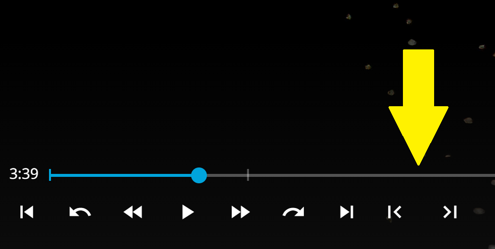

Overview of all my Jellyfin Web VideoOSD projects: [Jellyfin-VideoOSD-Projects-Overview](https://github.com/chrissix666/Jellyfin-VideoOSD-Projects-Overview)

---

Note: This script is compatible with the [Jellyfin-VideoOSD-CustomOnOff-Menu](https://github.com/chrissix666/Jellyfin-VideoOSD-CustomOnOff-Menu).

# Jellyfin VideoOSD FrameByFrame Buttons

Adds frame-by-frame control buttons to the **Jellyfin Web VideoOSD**, letting you step one frame backward or forward during paused playback.

This script adds two small frame step buttons directly into the VideoOSD transport bar.  
It detects the current video’s frame rate from the active Jellyfin session and uses it to calculate accurate one-frame jumps.

Tested on & Requirements: Windows 11, Chrome, Jellyfin Web 10.10.7, JavaScript Injector.

---

## Important Disclaimer: Frame Stepping Accuracy

This script is **not a true frame-by-frame engine** like the one found in dedicated video players such as VLC.  
It works within the limitations of the Chrome / Chromium video engine.

The script detects the FPS of the currently playing video and calculates the frame step duration from that value.  
For videos with a relatively clean frame rate, for example `30 fps`, one click usually results in one visible frame step.

For videos with uneven or unusual frame rates, for example around `23.976 fps`, the step value is calculated as precisely as possible, but browser seeking behavior may still cause occasional empty clicks.  
This means that every few clicks, the playback position may not visibly move to the next frame.

A possible workaround would be to increase the step multiplier slightly, for example from `1.0` to `1.1`.  
However, this can cause real frames to be skipped.

For this reason, the script intentionally prefers occasional empty clicks over skipping frames on unusual frame rates.

---

## Features

- Adds previous-frame and next-frame buttons directly to the Jellyfin VideoOSD.
- Steps one frame backward or forward based on the detected video frame rate.
- Automatically pauses the video before frame stepping.
- Uses the active Jellyfin session to read the current media frame rate.
- Caches the detected frame rate for the currently playing item.
- Can be toggled through the Custom On/Off Menu if installed.
- Works fully client-side, without backend changes.

---

## Behavior

The buttons are added next to the VideoOSD playback controls.

The left button steps one frame backward.  
The right button steps one frame forward.

When a button is clicked, the video is paused and the playback position is moved by one frame.  
The frame step size is calculated from the detected frame rate of the currently playing video.

For example:

- 24 fps → about 0.0417 seconds per frame
- 25 fps → 0.04 seconds per frame
- 30 fps → about 0.0333 seconds per frame

If no frame rate can be detected, the script does not step blindly.  
This avoids inaccurate jumps.

---

## Custom Menu Integration

This script supports the Jellyfin VideoOSD Custom On/Off Menu.

When the Custom On/Off Menu is installed, this script registers itself as:

**Frame Buttons**

It can then be enabled or disabled directly from the Custom On/Off submenu during video playback.

If the Custom On/Off Menu is not installed, the script can still run standalone.

---

## Installation

1. If not already present, install a JavaScript injector plugin or userscript manager  
   (Jellyfin JavaScript Injector, Tampermonkey, Violentmonkey, or similar).

2. Paste the content of the FrameByFrame Buttons script into the injector.

3. Optional: Install the Custom On/Off Menu script if you want to toggle this script directly from the video playback submenu.

4. Save and reload Jellyfin Web.

5. Start video playback.

---

## Notes and Limitations

- Frame stepping depends on the frame rate reported by Jellyfin for the current media item.
- If no valid frame rate is available, no frame step is performed.
- Browser seeking precision can slightly affect exact frame positioning.
- On unusual frame rates, occasional empty clicks may happen. This is intentional to avoid skipping frames.
- The buttons hide automatically when the player width becomes too small, matching the responsive behavior of Jellyfin’s chapter jump buttons.
- Custom On/Off Menu integration is optional.
- No Jellyfin server setting is changed.
- No backend interaction is required.

---

## Tested On

- Jellyfin Web 10.10.7
- Google Chrome
- Windows 11

---

## License

MIT
